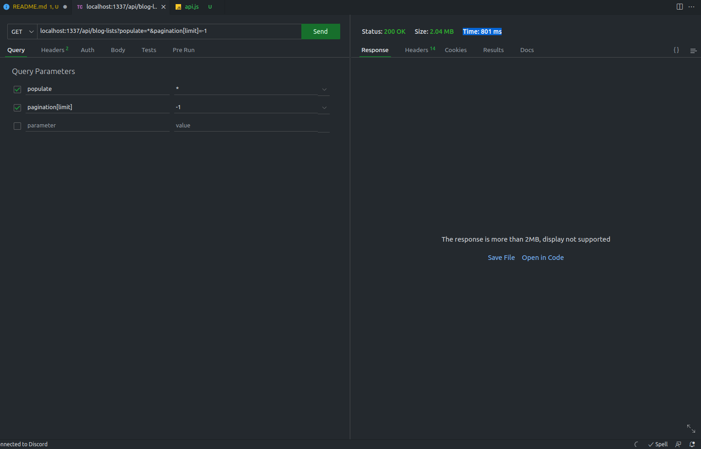
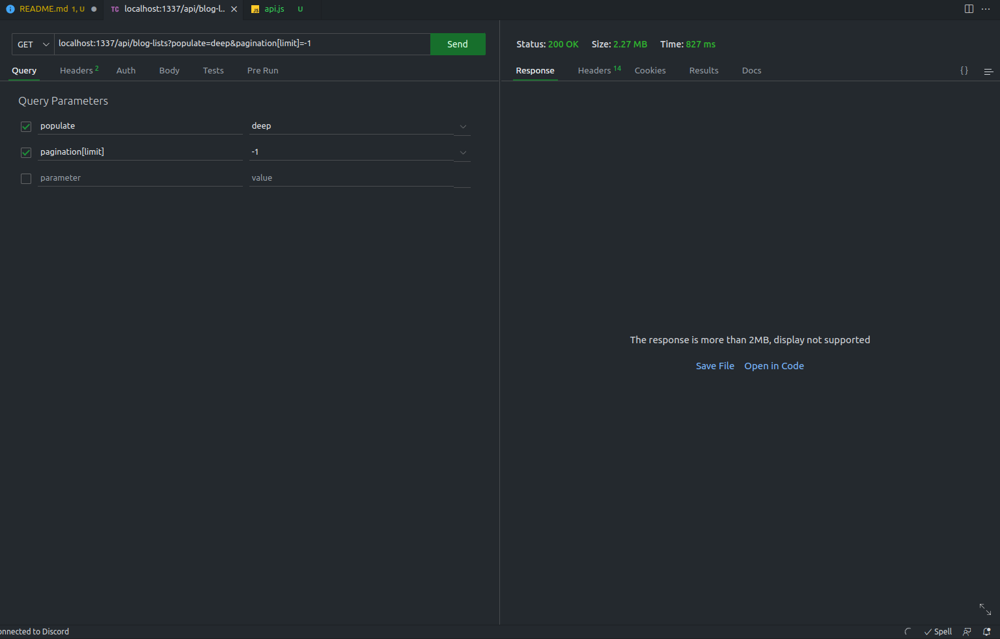
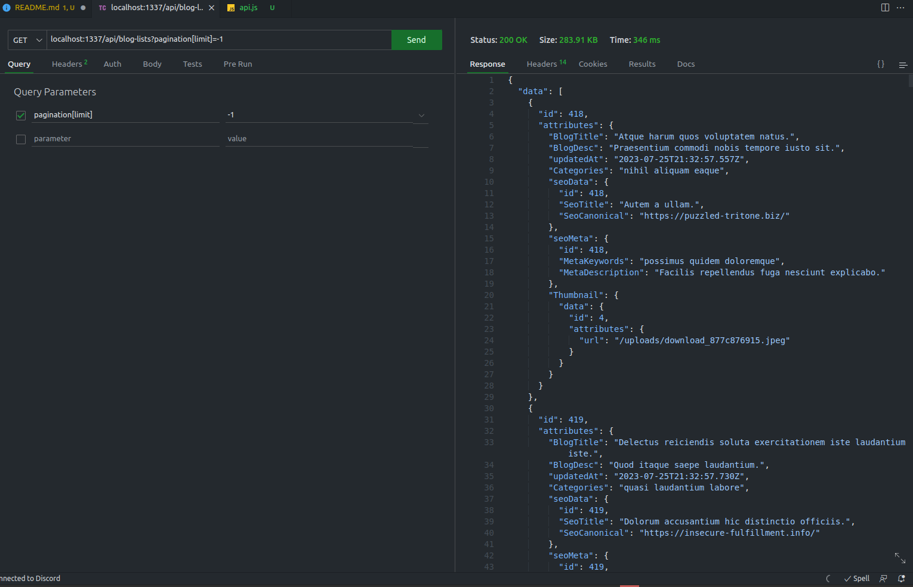
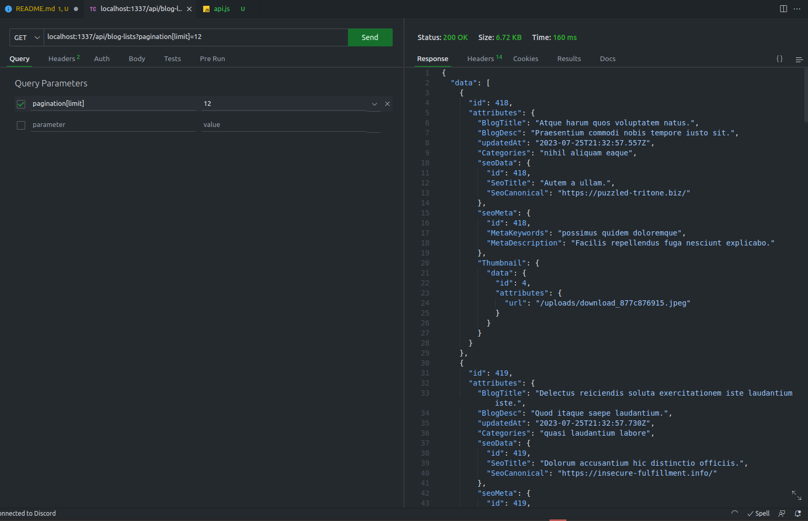

# Default population and field selection middleware

This example app is designed to show how you can cut down on your request payload size (and thus decrease latency in requests) by configuring the default population via a route middleware for the Strapi Content-API

## Example setup

In this example there is a [blog content-type](src/api/blog-list/content-types/blog-list/schema.json) with a bunch of fields and components (the structure of this isn't particularly important) and a [middleware](src/api/blog-list/middlewares/blogListDefaultPopulate.js) that is configured on the `find` and `findOne` [routes](src/api/blog-list/routes/blog-list.js) for the content-api endpoints.

In this example there is a sample database provided with some test data (505 blog posts). The default login for this is:

```
email: test@test.com
password: Test1234!
```

## Seeing the difference in payload size

In this example we will compare several different request types with different queryString parameters to see the difference in payload size. Note that in this example the api max limit was changed to an extremely high number. This is not recommended for production use.

See the following documentation for both [populate](https://docs.strapi.io/dev-docs/api/rest/populate-select#relations--media-fields) and [field selection](https://docs.strapi.io/dev-docs/api/rest/populate-select#field-selection) for more information on these features.

- `populate=*` - This will return all fields and components for the content-type up to the first level
- `populate=deep` - Using the community package [strapi-plugin-populate-deep](https://market.strapi.io/plugins/strapi-plugin-populate-deep)
- middleware (large page size) - Using the custom middleware but no server-side pagination
- middleware (with proper pagination) - Using the custom middleware with server-side pagination

### `populate=*`

Example request: `GET /api/blog-lists?populate=*&pagination[limit]=-1`
Request Time: 801ms
Payload Size: 2.04 MB



### `populate=deep`

Example request: `GET /api/blog-lists?populate=deep&pagination[limit]=-1`
Request Time: 827ms
Payload Size: 2.27 MB



### middleware (large page size)

Example request: `GET /api/blog-lists?pagination[limit]=-1`
Request Time: 346ms
Payload Size: 283.91 KB



### middleware (with proper pagination)

Example request: `GET /api/blog-lists?pagination[limit]=12`
Request Time: 160ms
Payload Size: 6.72 KB



Note: this is a simplified version of pagination, we strongly recommend checking out our [pagination documentation](https://docs.strapi.io/dev-docs/api/rest/sort-pagination#pagination-by-page)

## Conclusion

As you can see in the sample responses we decreased the total response time by a little over 7x and the response payload size by 320x. This is a huge improvement and can make a big difference in your application's performance. It's important to note that you should be using server-side pagination unless you are doing static site generation as this will make the largest difference. Strapi does not recommend increasing the maximum page size to an extremely high number as this can cause performance issues with your database/application and if anything you should decrease this to a lower number.

Additionally you can layer something like network or application caching to further improve your performance.

The sample middleware provided here is a very basic example but could be heavily customized to fit your exact needs.
